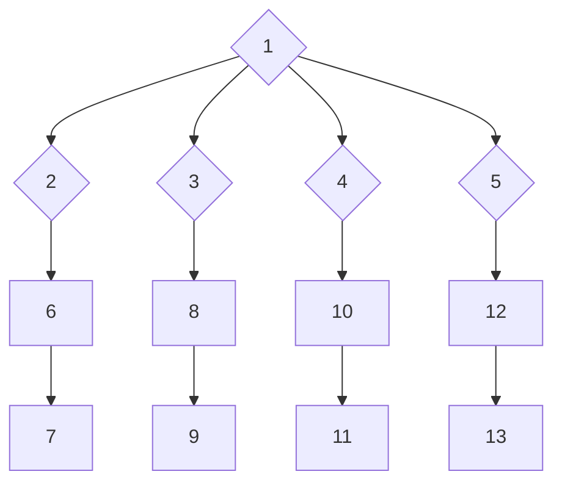

# Objectives and Key Results for version 0.0.2

## demo-dumpkeys output the type and value of received inputs

* When pressing "A", the program outputs "printable character A (65)"
* When pressing a printable character part of multi-octet encoding, the programm outputs only its numeric value "printable character (xx)"
* When pressing the arrow key "up", the program outputs "keystroke : arrow up" (case insensitive)

|Task ID|Object|
|---|---|
|1|[EPIC] demo-dumpkeys output the type and value of received inputs|
|2|[EPIC] demo-dumpkeys supports unknown input types|
|3|[EPIC] demo-dumpkeys supports single-octet inputs|
|4|[EPIC] demo-dumpkeys supports multi-octets inputs, and supports broken sequences|
|5|[EPIC] demo-dumpkeys supports cursor location reports|
|6|VtInputSource supports VtInputNone inputs|
|7|VtInputFromCharacters supports VtInputNone inputs|
|8|VtInputSource supports single-octet inputs|
|9|VtInputFromCharacters supports single-octet inputs|
|10|VtInputSource supports multi-octets inputs, and supports broken sequences|
|11|VtInputFromCharacters supports multi-octets inputs, and supports broken sequences|
|12|VtInputSource supports cursor location reports|
|13|VtInputFromCharacters supports cursor location reports|

